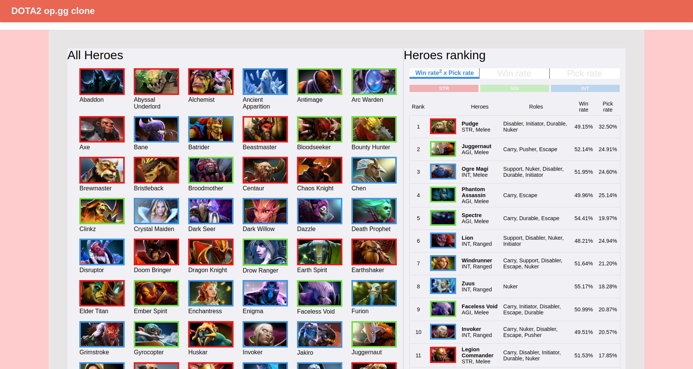

# Dota 2 op.gg clone

## Project Intro

My version of [OP.GG](https://www.op.gg/champion/statistics) for the game [Dota2](https://en.dota2.com/) in the form of toy web apps written in python, SQL and some HTML/CSS/js containerized and orchestrate with Docker and Docker-compose.

### OP.GG
This website provides insights to gamers for League of Legends, PlayerUnknown's Battlegrounds, Overwatch and eSports. They are building a platform where gamers can express and share their game identities and experiences, more info [here](https://www.op.gg/about/)

### DOTA 2
[Dota2](https://en.dota2.com/) is a multiplayer video game in which two teams (known as the Radiant and Dire) of five players compete to destroy a large structure defended by the opposing team (MOBA). Ten players each control one of the game's 119 playable characters, known as "heroes".

### Why ?
[OP.GG](https://www.op.gg/champion/statistics) does not provide stats on Dota 2, so as a player I decided to start building it

   |  
:-------------------------:|:-------------------------:
 Homepage |  Hero focus
## Technical stack

### Schema


### Tree structure
```bash
.

├── db
│   ├── 1_init.sql
│   ├── 2_load_data.sql
│   ├── 3_custom_tables.sql
│   ├── Dockerfile
│   ├── init_data
│   └── scripts
├── server
|   ├── app
|   ├── boot.sh
|   ├── config.py
|   ├── Dockerfile
|   └── requirements.txt
└──  etl
    ├── celery_app.py
    ├── celeryconfig.py
    ├── Dockerfile
    ├── etl
    ├── requirements.txt
    └── wait_for_mysql_db_backend.py

```

The project falls into three repositories:  
* <b>db</b> contains:  
&nbsp;&nbsp;&nbsp;- sql scripts to init MySQL db  
&nbsp;&nbsp;&nbsp;- init data to feed the database    
&nbsp;&nbsp;&nbsp;- DockerFile to build db image  
* <b>server</b> contains:  
&nbsp;&nbsp;&nbsp;- Flask app with boot.sh as entrypoints (including routes, html/css/js files)   
&nbsp;&nbsp;&nbsp;- DockerFile to build server image  
* <b>server</b> contains:  
&nbsp;&nbsp;&nbsp;- Celery app with boot.sh as entrypoints  
&nbsp;&nbsp;&nbsp;- DockerFile to build server worker that embeded worker, beat and flower services 


## Getting started

1. Clone the project
```
git clone https://github.com/cygilbert/dota2_opgg_clone
cd dota2_opgg_clone
```
2. Check if docker-compose is installed on your machine
```
docker-compose --version
```
If not: [https://docs.docker.com/compose/install/](https://docs.docker.com/compose/install/)  


3. (Optionnal) Get Steam API Key [here](https://steamcommunity.com/login/home/?goto=%2Fdev%2Fapikey)
You need a steam account. If you dont want to get one key, the project will still run but the ETL jobs won't request anything from API and you will just visualize [init data](db/init_data) 
Once you get a key put it in a environment file
```
echo "API_KEY_STEAM=your-api-key" > .env
```
4. Run project
```
docker-compose up --build
```

The apps front-end is available at the [port 5000](localhost:5000/), ETL jobs monitoring at [port 5555](localhost:5555/) and MySQL database server at [port 32000](localhost:32000/) 

## TO DO
- Deployment
- Streaming jobs
- Itemization feature